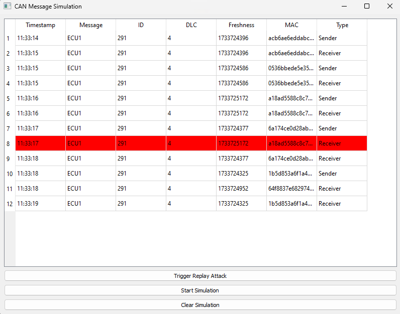
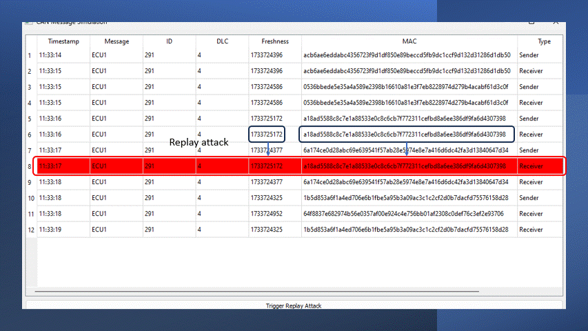

[](https://github.com/AasaiAlangaram/Python-LIN-Diagnostic-Tool/blob/master/LICENSE)

# SecOC (Secure On-Board Communication) Simulation

This is a Python-based simulation of the **Secure On-Board Communication (SecOC)** protocol, which is designed to ensure secure communication within an ECU network, such as for automotive applications. This simulation mimics two ECUs (Electronic Control Units) that send and receive messages over a simulated CAN bus while implementing basic security features such as Message Authentication Code (MAC) and freshness checks to prevent replay attacks.

## Features
- **Message Authentication**: Uses HMAC with SHA256 to ensure message integrity and authenticity.
- **Replay Attack Detection**: Implements freshness timestamps to detect replay attacks based on stale message freshness.
- **Key Rotation**: Periodically rotates the secret key used to generate MACs to enhance security.
- **CAN Bus Simulation**: Simulates the transmission of messages between sender and receiver ECUs over a queue that mimics a CAN bus.
- **Logging**: Displays simulation logs in the console to track the communication and security checks (e.g., successful authentication, replay attacks).
  
## Requirements
- Python 3.6 or higher
- PyQt5 (for UI in case of GUI implementation, but can be removed if not needed)
- `queue` (Python standard library)

## How it Works
This simulation features two main components:

Sender ECU: Simulates an ECU that sends a message over the "CAN bus" (represented by a queue). Each message is accompanied by a Message Authentication Code (MAC) and a freshness timestamp.
Receiver ECU: Simulates an ECU that receives the message, verifies the MAC and freshness timestamp, and checks if the message is valid or if a replay attack is detected.
The system will log:

Successful authentications
Detected replay attacks
Key rotations
Any errors or malformed messages
Key Components:
MAC Generation: Uses HMAC with SHA256 to generate a unique authentication code for each message.
Freshness Check: Compares the freshness (timestamp) of each message to the last received one to prevent replay attacks.
Key Rotation: The secret key is periodically changed to enhance security, preventing attacks that exploit key reuse.

## Usage
### Running the Simulation
To run the SecOC simulation, follow these steps:

Clone this repository to your local machine:

```bash
git clone https://github.com/yourusername/SecOC-Simulation.git
cd SecOC-Simulation
```
Run the simulation:

```bash
python secoc_simulation.py
```

Logs
During the simulation, you'll see logs printed to the console indicating:

When a message is sent or received.
If the MAC is verified successfully.
If a replay attack is detected due to freshness issues.
When the key is rotated to ensure ongoing security.

## ECU Log Example

Here is an example of the ECU log output:

```plaintext
[ECU 1] Sent: 0x123|12|EngineTemperature:85|1618001234|abc123...
[ECU 2] Received: 0x123|12|EngineTemperature:85|1618001234|abc123...
[ECU 2] Message authenticated: EngineTemperature:85 (ID: 0x123, DLC: 12, Freshness: 1618001234)
[ECU 2] Replay attack detected! Freshness is too old.
```

## UI





## UI Features
- Start/ Stop Simulation
- Clear Simulaiton
- Trigger Replay Attack

## Upcoming features
Testing with Vector SIL Kit

